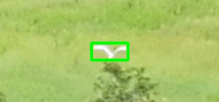
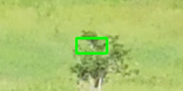

# Motion-Prior Tracker

A **pluggable physics-prior** visual object tracking framework.

> 不是「一个模型吃遍所有物理」，而是「**框架不变，物理模型可换**」。
> Not *"one model for all physics"* — but *"the loop stays fixed, the physics model is pluggable."*

## What this is

The tracking loop — context-enlarged template matching, 50-scale dense search with
quadratic interpolation, EMA smoothing, and original-template re-acquisition — is
**fixed**. The kinematic prior — constant velocity, Kalman, constant acceleration,
bird-flight dynamics, projectile, … — is a `MotionModel` you swap in **one line**.

That turns "mechanics × vision" into a one-line switch, and lets you measure the
*marginal value* of a physics prior against a pure-appearance baseline.

## Why

Small targets (a bird is a few dozen pixels in a 4K frame) are easy to lose under
fast maneuvers, occlusion and deformation. An explicit motion prior fills the gap
appearance alone cannot cover.

This generalizes a bird tracker built for the SYSU undergraduate research project
*「大规模鸟类数据集构建与跟踪算法研究」* ("Large-scale bird dataset construction
and tracking"), with the bird-specific parts stripped out.

## The plug-in contract

A motion model is a stateful object with three methods:

| method | meaning | mutates state? |
|---|---|---|
| `predict()` | predicted position for the next frame | no |
| `update(z)` | fold a measurement `z` into the state | yes |
| `advance()` | advance the dynamics one step with **no** measurement (target lost) | yes |

The loop only ever calls these three methods, so the physics can be swapped without
touching the loop. `advance()` exists because a *lost* frame has no measurement —
`ConstantVelocity` used to fake it as `update(prediction)`, but a Kalman filter must
not feed its own prediction back as a measurement (that would spuriously shrink its
covariance).

## Motion models

| model | status | notes |
|---|---|---|
| `ConstantVelocity` | ✅ v0.1 | baseline; bit-for-bit equivalent to the original inline math |
| `KalmanFilter` | ✅ v0.2 | constant-velocity Kalman filter (pure numpy), state-space + covariance |
| `ConstantAcceleration` | planned | x″ = const |
| `BirdFlight` | planned | bird flight-dynamics prior — the research novelty |
| `Projectile` | planned | ballistic prior — proves the framework is general |

## Quick start

Dependencies: `numpy`, `opencv-python`.

```bash
pip install numpy opencv-python
```

Put image sequences in a folder, one subfolder per sequence (the first frame needs a
YOLO reference `.txt`), then:

```bash
python motion_prior_tracker.py --input /path/to/sequences --output /path/to/out --model ConstantVelocity
```

Output is YOLO-format `.txt` (`class_id cx cy w h`). Run the same loop with a Kalman
prior by swapping `--model KalmanFilter`.

## Demo

Real bird sequence (4K video, 5-frame sampling, target ≈ 40×25 px, <1% of the frame).
Green box = target.

**Reference (frame 0), zoomed crop:**



**Tracking (frame 50), zoomed crop:**



Downscaled full frames (to see how small the target is):
`examples/demo/seq16_000461.jpg`, `seq16_000711.jpg`.

## Tests

```bash
python tests/test_motion_models.py
```

Verifies the extracted `ConstantVelocity` reproduces the original tracker's inline
math **frame-for-frame**, and that `KalmanFilter` behaves as a correct
constant-velocity Kalman filter (recovers velocity, beats the raw measurement).

## Directory

```
motion-prior-tracker/
├── motion_prior_tracker.py   # tracking loop (the fixed framework)
├── motion_models.py          # pluggable motion priors
├── examples/
│   ├── visualize.py          # box/crop drawing tool
│   └── demo/                 # example images
├── tests/
│   └── test_motion_models.py # equivalence + Kalman tests
└── README.md
```

## License

[MIT](LICENSE) © 2026 Kevin Yan
